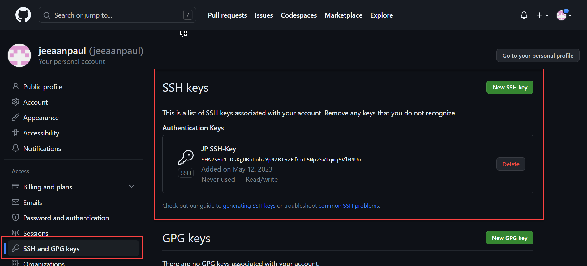
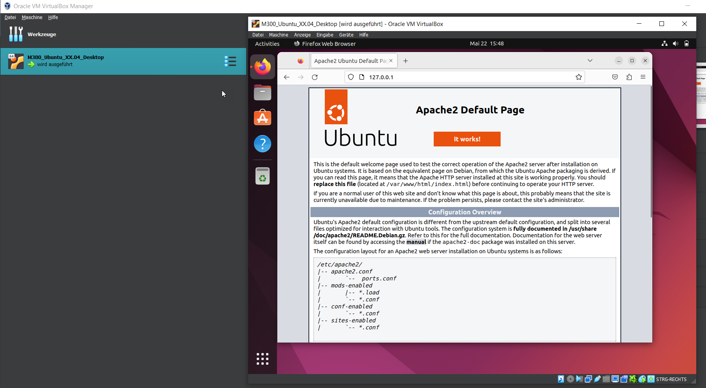
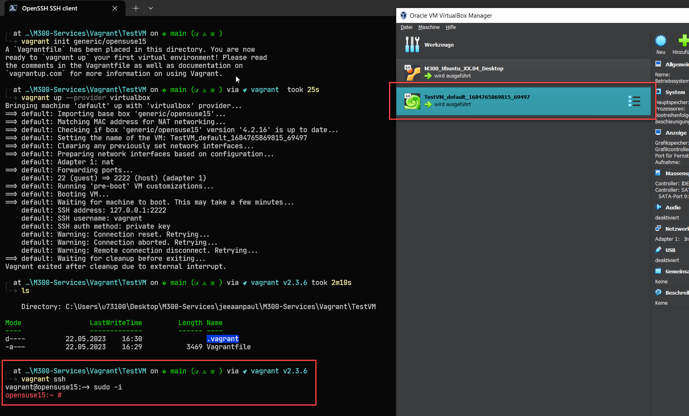
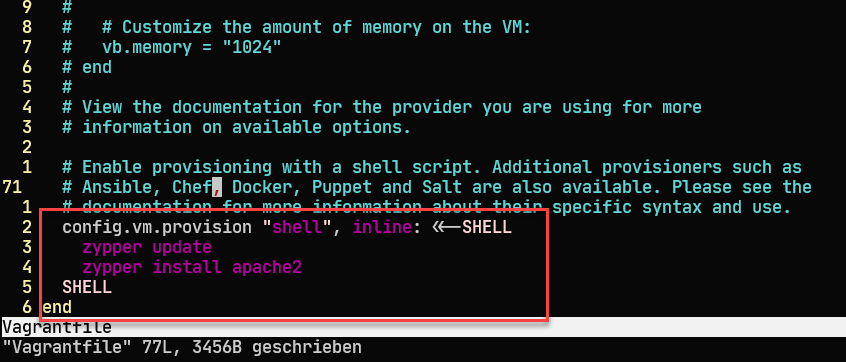

# Kapitel 10: Toolumgebung aufsetzen 

## Vorbereitungen:

Als erstes habe ich alle nötigen Programme für das Modul installiert und mich um die Dokumentationsplattform gekümmert.

- GitHub Account & Repository erstellt
- Git Client installiert
- VirtualBox installiert
- Vagrant installiert
- Visual Studio Code eingerichtet
  - GitHub Repository geklont
  - Markdown Extension installiert & zweites Fenser mit MD Preview


> ### SSH Key
> Damit ich über SSH auf mein Repository zugreifen kann, habe ich lokal ein SSH Key-Pair erstellt und den Public Key in meinem GitHub Account hinterlegt:



***
<br>

## Apache Webserver 
Nach dem ich alle Vorbereitungen erledigt habe und mich mit Git vertraut machen konnte habe ich mit dem Einrichten der Ubuntu VM für den Webserver begonnen.

Als erstes habe in VirtualBox die ISO angehängt und Ubuntu manuell installiert. Danach habe ich die Repos und Pakete aktualiert und anschliessend den Apache Webserver installiert.

```
$ sudo apt-get install apache2
$ sudo systemctl status apache2 # status des Webservers
$ sudo systemctl enable apache2 # apache soll automatisch nach dem reboot starten
```
<br>



***
<br>

## Vagrant
Zur automatisierten Erstellung und Verwaltung von VMs, habe ich das Prgramm Vagrant installiert.

> Für jede VM erstelle ich einen weiteren Ordner im Verzeichnis ../Vagrant/

Als erstes habe ich zum testen einen TestVM Ordner erstellt. Danach habe ich ein Vagrant File erstellt und die VM wie folgt erstellt:


***
### Apache automatisch aufsetzen
- Im nächsten Schritt habe ich die TestVM nochmals gelöscht und das Vagrant File so angepasst, dass bei der VM installation der Apache Webserver direkt mitinstalliert wird. 



